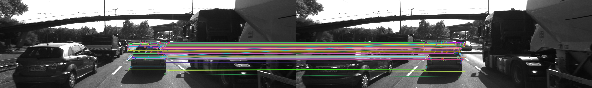
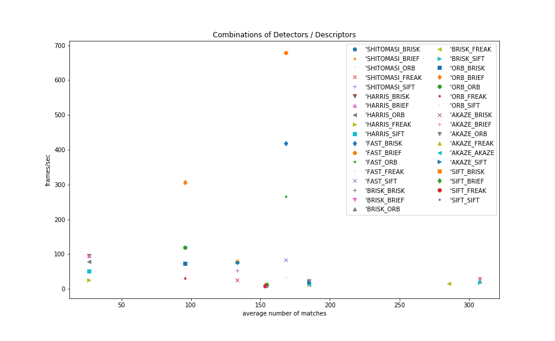

# ** 2D Feature Tracking Project**

## Circular buffer
The circular buffer was implemented making use of the vector class. Before adding a new entry to the end of the vector the first entry was removed in case there would be too many images in the vector after the subsequent add.

## Feature Tracking Pipeline Performance
### Number of keypoints for different detectors
Iterating through all the detectors it became apparent that there are huge differences in how many keypoints get detected. The table below shows the number of keypoints for the entire sequence of 10 images.

| Detector    |   number of keypoints on car |   distribution             |
| -------------- | ----------------------:| --------------------------- |
| Shi Tomasi  |                    1179 |      many on car outline   |
|     Harris  |                          248 |      all on upper part     |
|       FAST  |                        1491 |     distribute evenly      |
|      BRISK  |                       2713 |     distributed evenly     |
|        ORB  |                          857 |     upper part on outline  |
|      AKAZE  |                      1655 |     distribute on outline  | 
|      SIFT   |                         1371 |     outline, window        | 

### Matches for combination of detectors / decriptors
The table below contains the accumulated number of all matches for the according combination of detector/descriptor. Horizontally there are the detectors, vertically the descriptors are listed.

|                   | Shi Tomasi |  Harris  |  FAST  |  BRISK  |  ORB  |  AKAZE |  SIFT   |
|---------------|--------------|-----------|----------|-----------|---------|-----------|---------|
| BRISK       |    1067       |   214    |   1348   |     2463 |   766  |   1480   |   1235 | 
| BRIEF        |    1067      |   214    |  1348    |     2463 |   766  |   1480   |   1236 |
| ORB          |    1067      |   214    |   1348    |    2463  |   766  |   1480   |    -       |
| FREAK      |     1067      |    214   |   1348    |    2283  |   766  |   1480   |   1226 |
| AKAZE      |    -             |      -        |    -         |      -       |    -      |   1480   |     -     |
| SIFT          |    1067      |     214    |    1348   |    2463  |    766 |     1480 |   1236 |  

The non-working combination were evaluated by reading parts of the [OpenCV documentation](https://docs.opencv.org/3.4/d8/d30/classcv_1_1AKAZE.html) which mentions that AKAZE descriptors only work with AKAZE keypoints. The other non-working combination SIFT/ORB was detected using a trial and error approach.

### Execution time for detector / descriptor combinations
The table below gives the measured average execution time for all combinations of detector/descriptor in ms. The average is taken over the full sequence of 10 images.

|                   | Shi Tomasi |  Harris  |  FAST  |  BRISK  |  ORB  |  AKAZE |  SIFT   |
|---------------|--------------|-----------|----------|-----------|---------|-----------|---------|
| BRISK       |   12.8        |  10.1     |   2.37   |     35.4 |   13.0 |   41.6   |   77.6 | 
| BRIEF        |   12.4        |   9.7    |  1.45    |     33.2 |   3.2  |   39.0   |   76.9 |
| ORB          |  14.8        |   12.3   |   3.82    |    42.0  |   8.4  |   46.0   |    -       |
| FREAK      |    38.4       |   38.9   |   30.8    |    62.1  |   32.6|   67.5   |   107.0|
| AKAZE      |    -            |      -        |    -       |      -       |    -      |   68.0   |     -     |
| SIFT          |    18.1      |     19.4   |    12.4   |    51.2  |    29.2|     52.7 |   118.7|  

### Analysis of Matches and Execution time
In order to compare the many permuations I decided to visualize the results in a diagram showing the average number of matches on the x-axes and the number of frames per second (being an reciprocal of the execution time) for both the detector and the descriptor.

Looking at the data there are clearly two interesting spots that detector/descriptor combinations are in.
The first one to look at are those with many matches which are relatively slow shown on the lower/right corner of the diagram:

|  Detector  |  Descriptor   |  avg. Matches  |  avg FPS                     |
| ------------- | ---------------- | -------------| ----------------------------|
|   BRISK     |   BRIEF         |    307.875  |         29.6436              |
|   BRISK     |   BRISK         |    307.875  |         28.4002              |
|   BRISK    |   ORB          |      307.875  |       23.0846             |
|   BRISK   |    SIFT         |      307.875   |       19.3258          |

The other interesting spot are the combinations with reasonable amount of matches which are very fast shown in the upper/middle part of the diagram.

|  Detector  |  Descriptor   |  avg. Matches  |  avg FPS                     |
| ------------- | ---------------- | -------------------| ----------------------------|
|   FAST      |     BRIEF       |      168.5            |   679.222     |

Both detectors show some wrong matches during the scene, by looking at it I would conclude that the Brisk/Brief combination has percentage wise less mismatches than FAST/BRIEF.

### Factors for the decision
While quality wise the BRISK/BRIEF seems to be slightly ahead the question is what is the impact of the long computation time required to achieve this. Assuming additonal computation time required for evaluation and additional checks BRISK/BRIEF would probably be able to run at 20fps with a latency of 1/20sec which increases the reaction time of the system significantly. At 50km/h difference in speed the calculation time of 1/sec is already 70cm.

### Decision 
My decision is to go with FAST/BRIEF as I will be able to get much more actual data of the situation which should outweight the potentally slightly higher rate of false matches.